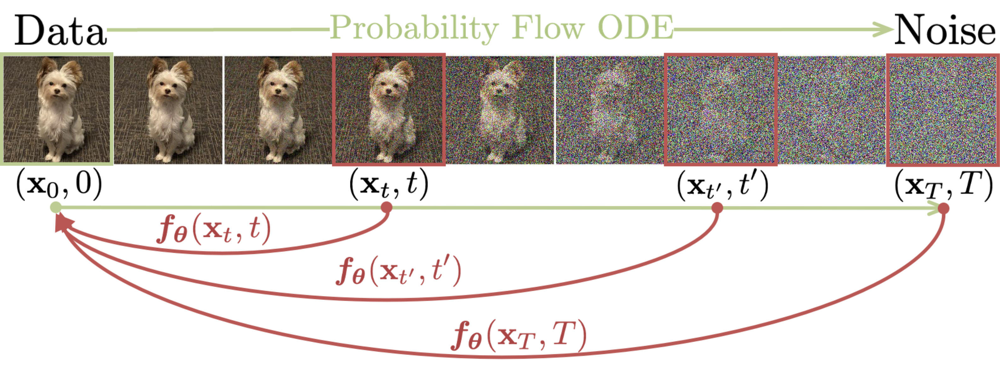

# Consistency Models

Implementation of Consistency Models [(Song et al., 2023)](https://arxiv.org/abs/2303.01469) in PyTorch.

<br />



## Installation

```sh
$ pip install consistency
```

## Usage

```python
import torch
from diffusers import UNet2DModel
from consistency import Consistency

consistency = Consistency(
    model=UNet2DModel(sample_size=224),
    learning_rate=1e-4,
    data_std=0.5,
    time_min=0.002,
    time_max=80.0,
    bins_min=2,
    bins_max=150,
    bins_rho=7,
    initial_ema_decay=0.9,
)

samples = consistency.sample(16)

# multi-step sampling, sample from the ema model
samples = consistency.sample(16, steps=5, use_ema=True)
```

`Consistency` is self-contained with the training logic and all necessary schedules. It subclasses `LightningModule`, so it's supposed to be used with `Lightning.Trainer`.

```python
trainer = Trainer(max_epochs=8000, accelerator="auto")
trainer.fit(consistency, some_dataloader)
```

A complete example can be found in [this script](https://github.com/junhsss/consistency-models/blob/main/examples/train.py).

## Result

[Example wandb workspace](https://wandb.ai/junhsss/consistency/runs/pn566sjt?workspace=user-), with a batch size of **512**, **~20K** steps on `cifar10`.
